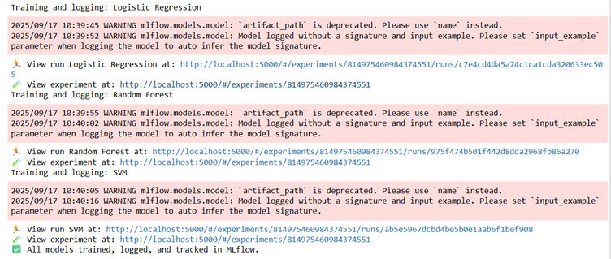
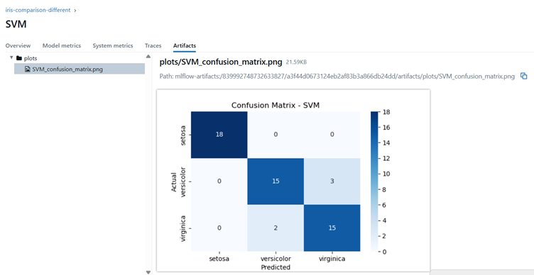
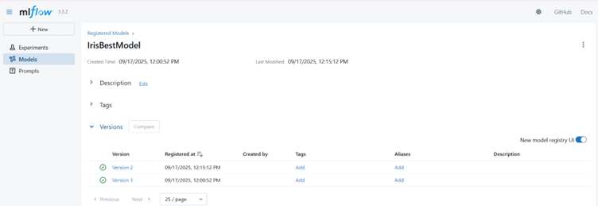

# mlops-assignment-1

## Part 4 – Model Registration (Steps)

1. **Start MLflow Tracking Server**  
   Run the following command in terminal to start MLflow UI:  
   ```bash
   mlflow ui --host 0.0.0.0 --port 5000


   ## MLflow Tracking Screenshots

- **Experiments Logged in MLflow**  
  

- **Confusion Matrix Example**  
  

- **Model Registry Example**  
  

